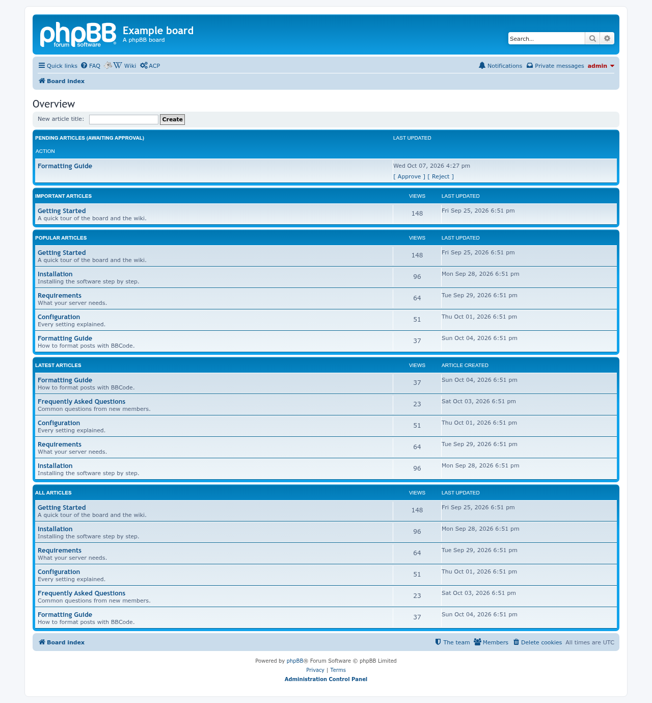
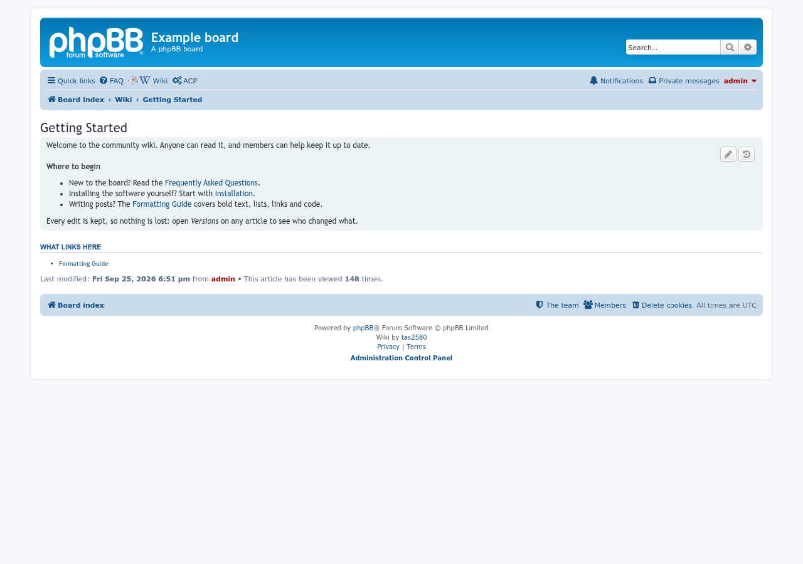
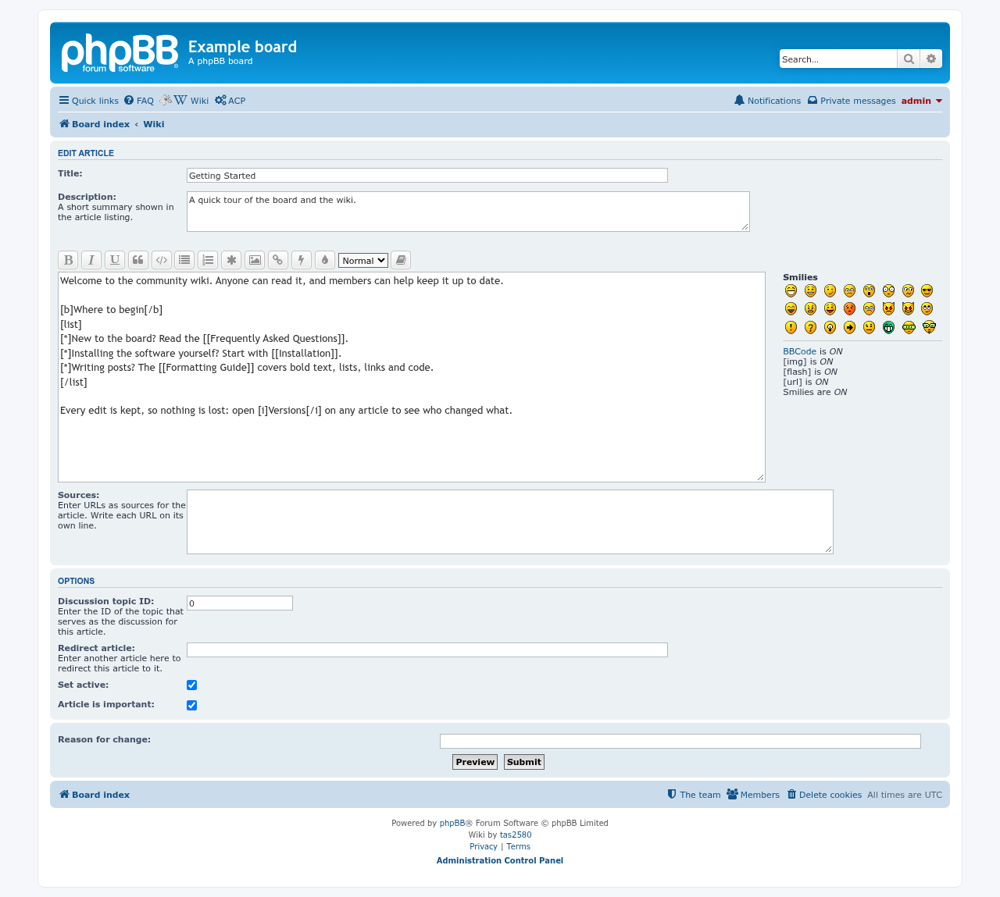
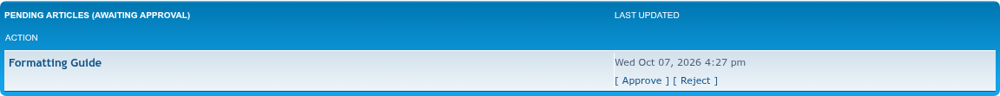
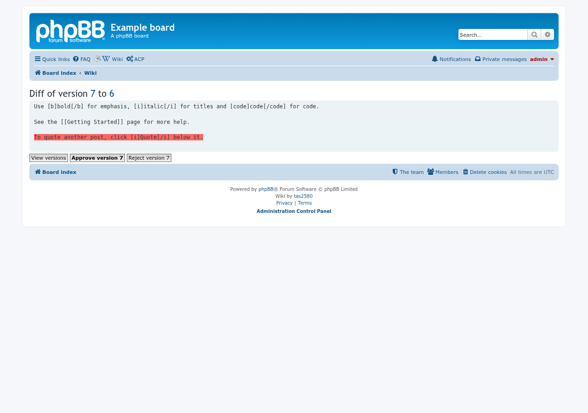
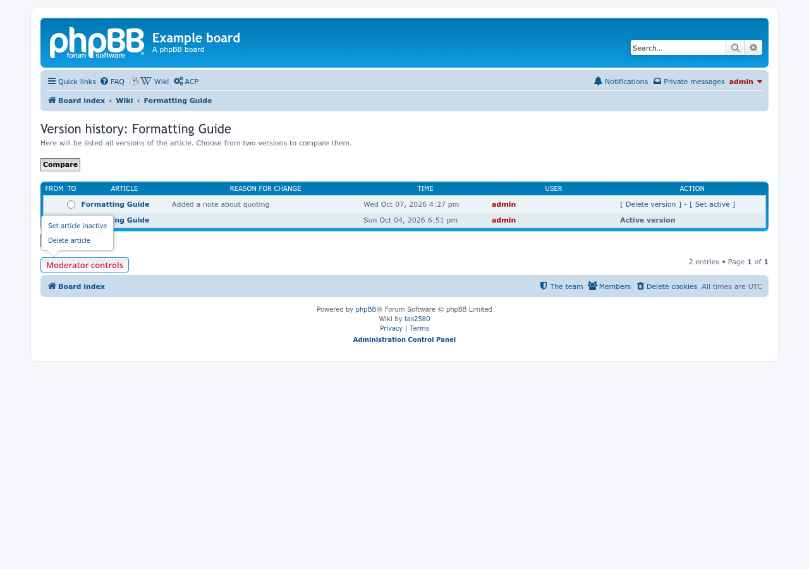

# phpBB Modders Wiki

 

A wiki for phpBB with version history, side-by-side compare, and a moderation queue for edits.

## Features

- A wiki at `/wiki`, with an overview page listing its articles.
- Start an article from the overview page's **New article title** box, or by linking to `/wiki/<article-name>` and following the link.
- Every edit is saved as a new version; compare any two versions side by side.
- Edits can wait for approval: moderators get a **Pending articles** list with Approve and Reject. Approving a version older than the live one is blocked, so a stale draft can't overwrite newer content.
- Moderators can take an article offline or delete it, and articles can be made sticky or set to redirect.
- Notifications when an edit is waiting for approval.
- Separate permissions for viewing, editing, version history, deleting and moderating.

## Screenshots

| Overview | Article |
|---|---|
|  |  |

| Editing | Pending review |
|---|---|
|  |  |

Approving or rejecting a pending edit shows a diff against the currently
active version:

The version history page also has a "Moderator controls" dropdown for taking
an active article offline or deleting it entirely:

## Requirements

- phpBB 3.3.19 or later (also tested on phpBB 4.0)
- PHP 7.4 or later

Tested versions and compatibility notes: [docs/compatibility.md](docs/compatibility.md).

## Installation

1. Copy the extension to `/ext/phpbbmodders/wiki`
2. In the Administration Control Panel, go to **Customise → Manage extensions**
3. Enable the **phpBB Modders Wiki** extension
4. Set who can view and edit the wiki under the usual Permissions screens

### Upgrading from `tas2580/wiki`

This extension used to be installed as `tas2580/wiki`. It is now
`phpbbmodders/wiki`. To switch an existing board without losing any
articles, versions, permissions or notification settings:

1. Disable the old **tas2580 Wiki** extension in the ACP. Do **not** delete its data.
2. Delete the `/ext/tas2580/wiki` folder.
3. Upload this version to `/ext/phpbbmodders/wiki` and enable it. The old
   install's migration history, notification type and users' notification
   settings are moved to the new name automatically; the wiki tables
   themselves never included the old name, so they are used as they are.
4. Purge the board cache.

If you disable the old extension from the command line (`bin/phpbbcli.php`)
instead of the ACP, run `bin/phpbbcli.php cache:purge` before enabling the
new one; the command-line disable doesn't clear the cache.

## TODO

Ideas not yet built, practical and speculative alike: [`docs/TODO.md`](docs/TODO.md).

## Contributing

Contributions are welcome!

- **Bug reports**: [Open an issue](https://github.com/phpbbmodders/phpbb-ext-wiki/issues).
- **Everything else** (questions, feature requests, ideas, general discussion): [Use Discussions](https://github.com/orgs/phpbbmodders/discussions), or the [community forum](https://www.phpbbmodders.com/community/).
- Pull requests are welcome for bug fixes or discussed features.

## Acknowledgments

- Original extension by [tas2580](https://tas2580.net).
- Updated for phpBB 3.2.x (notification API fixes, textreparser support) by
  Christian Schnegelberger ([Crizz0](https://www.crizzo.de)) in the
  [phpBB.de fork](https://github.com/phpbb-de/wiki).
- This fork builds on Crizz0's phpBB.de branch: fixed phpBB 3.3.x/4.0
  compatibility (routing, YAML parsing, notification API, Flash BBCode
  removal), completed missing English translations, added an approve/reject
  moderation queue for pending articles, and general bug fixes.
- Code review, bug fixes, and documentation assisted by [Claude](https://www.anthropic.com/claude).

## License

This extension is licensed under the **GNU General Public License v2.0**.

See [license.txt](license.txt) for more information.
